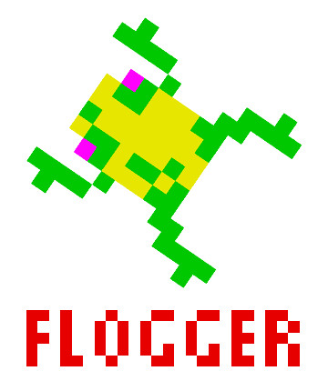

# Flogger
## A ready to use - zero conf - logger

### Install
```npm install --save 'flogger-log'```

### Basic usage


```javascript
import Flogger from 'flogger-log';

const flog = new Flogger();
flog.$debug('Something important');
flog.$error('Watch out!');
```

<div style="clear: left"></div>

## And it's customizable too!
You can change log levels (defaults are **debug**, **info**, **warning** and **error**) and how events are recorded passing options to Flogger constructor.  
The FileRenderer renderer, which saves events to file, is shipped with this package.

```javascript
import { Flogger, FileRenderer } from 'flogger-log';

// Use the shipped FileRenderer for saving log to file.
const flog = new Flogger({
  // Custom log levels, from less critical (left) to more critical (right)
  levels: ['foo', 'bar', 'tic', 'tac'],

  // Current minimum log level.
  // We are not going to log any event less critical than 'bar' (sorry foo...)
  level: 'bar',

  // Pass a FileRenderer instance to flogger
  renderer: new FileRenderer({ path: 'logfile.txt' })
});

// Use custom log functions (custom log levels)
flog.$bar('This will be logged');
flog.$foo('This will NOT');

// Or use the log() function directly
flog.log('hello', 'tic');
flog.log('world', 'tac');
```

## You can write your custom renderer too
A flogger renderer is just a object exposing a "render" function.  
The render function will receive three parameters, the level name, the origin of the event and the data passed to the log function.

In the simplest case the renderer is really just a plain object with a function. This is how the console renderer is implemented:

```javascript
export default {
  render(level, origin, message) {
    const timeDate = new Date().toUTCString();
    console.log(`${timeDate} - [${level}] ${origin}:`);
    console.log(message);
    console.log();
  },
}
```

The console renderer is included in this package and it's the default one if you don't specify one in the Flogger constructor options.

More advanced renderers could be written as classes accepting parameters in their constructors for fine-grained customization.

## License

```
MIT License

Copyright (c) 2018 Valerio Bianchi

Permission is hereby granted, free of charge, to any person obtaining a copy
of this software and associated documentation files (the "Software"), to deal
in the Software without restriction, including without limitation the rights
to use, copy, modify, merge, publish, distribute, sublicense, and/or sell
copies of the Software, and to permit persons to whom the Software is
furnished to do so, subject to the following conditions:

The above copyright notice and this permission notice shall be included in all
copies or substantial portions of the Software.

THE SOFTWARE IS PROVIDED "AS IS", WITHOUT WARRANTY OF ANY KIND, EXPRESS OR
IMPLIED, INCLUDING BUT NOT LIMITED TO THE WARRANTIES OF MERCHANTABILITY,
FITNESS FOR A PARTICULAR PURPOSE AND NONINFRINGEMENT. IN NO EVENT SHALL THE
AUTHORS OR COPYRIGHT HOLDERS BE LIABLE FOR ANY CLAIM, DAMAGES OR OTHER
LIABILITY, WHETHER IN AN ACTION OF CONTRACT, TORT OR OTHERWISE, ARISING FROM,
OUT OF OR IN CONNECTION WITH THE SOFTWARE OR THE USE OR OTHER DEALINGS IN THE
SOFTWARE.
```